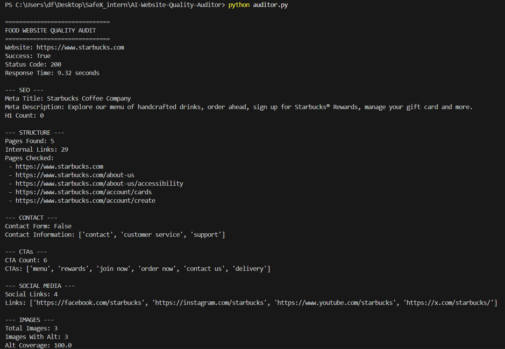
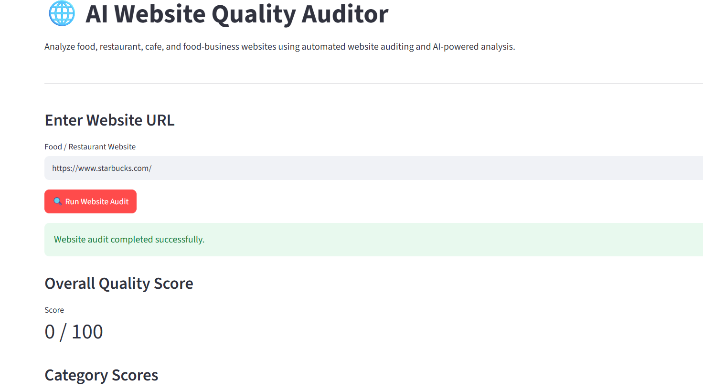
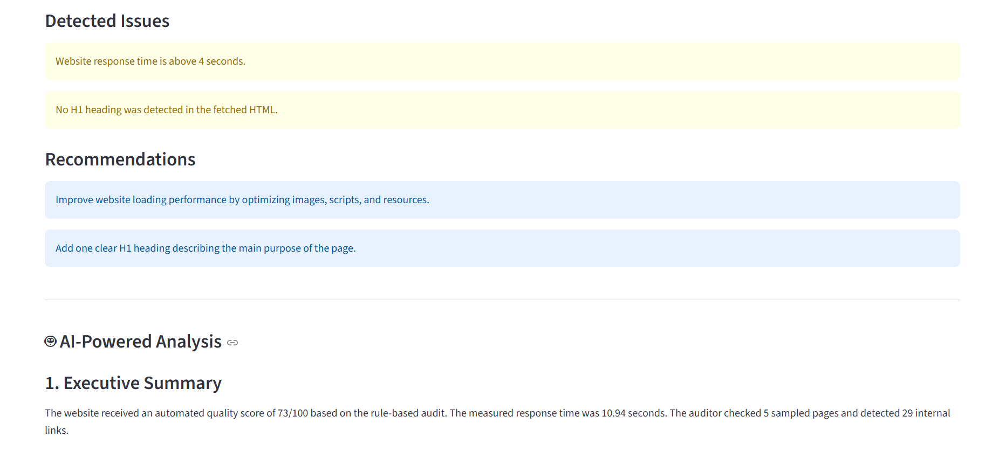
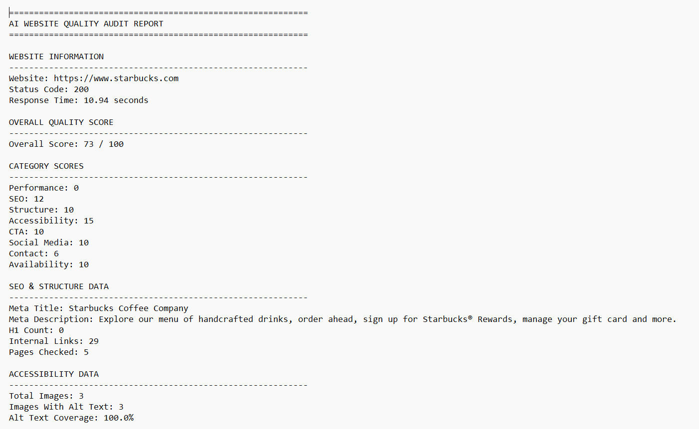

# 🌐 AI Website Quality Auditor

An automated website quality auditing tool designed for food and restaurant websites.

The project analyzes a website using browser automation, extracts measurable website characteristics, calculates a rule-based quality score, and generates an AI-assisted analysis and final report.

## 🚀 Features

* Automated website auditing
* JavaScript-rendered page analysis using Playwright
* SEO checks
* Website structure analysis
* Heading detection
* Internal link analysis
* Image and alt-text coverage analysis
* Food-business CTA detection
* Contact information detection
* Social media link detection
* Response-time measurement
* Rule-based quality scoring
* Gemini AI analysis with a rule-based fallback
* Streamlit web dashboard
* Automated text report generation
* JSON audit data export

## 🧠 How It Works

```text
User enters website URL
        ↓
Playwright browser audit
        ↓
Rendered HTML
        ↓
BeautifulSoup extraction
        ↓
Website quality metrics
        ↓
Rule-based scoring
        ↓
Gemini AI analysis
        ↓
Final report
        ↓
Streamlit dashboard
```

## 📊 Quality Metrics

The auditor evaluates the following categories:

| Category      | Maximum Score |
| ------------- | ------------: |
| Performance   |            15 |
| SEO           |            15 |
| Structure     |            15 |
| Accessibility |            15 |
| CTA           |            10 |
| Social Media  |            10 |
| Contact       |            10 |
| Availability  |            10 |
| **Total**     |       **100** |

## 🛠️ Technologies Used

* Python
* Playwright
* BeautifulSoup
* Streamlit
* Google Gemini API
* Requests
* python-dotenv
* JSON

## 📁 Project Structure

```text
AI-Website-Quality-Auditor/
│
├── app.py
├── auditor.py
├── llm_analyzer.py
├── report_generator.py
├── requirements.txt
├── website.json
├── ai_analysis.txt
├── final_report.txt
├── README.md
├── .gitignore
│
└── screenshots/
    ├── 01_terminal_audit.png
    ├── 02_dashboard_score.png
    ├── 03_ai_analysis.png
    └── 04_final_report.png
```

## ⚙️ Installation

Clone the repository:

```bash
git clone https://github.com/SalihaBibi/AI-Website-Quality-Auditor.git
cd AI-Website-Quality-Auditor
```

Create a virtual environment:

```bash
python -m venv .venv
```

Activate it on Windows:

```powershell
.venv\Scripts\activate
```

Install dependencies:

```bash
pip install -r requirements.txt
```

Install the Playwright browser:

```bash
python -m playwright install chromium
```

## 🔑 Gemini API Configuration

Create a `.env` file in the project root:

```text
GEMINI_API_KEY=your_api_key_here
```

The `.env` file is excluded from Git using `.gitignore`.

Never commit your API key to GitHub.

## ▶️ Run the Auditor

To run the terminal-based website audit:

```bash
python auditor.py
```

The audit results are saved to:

```text
website.json
```

## 🤖 Run AI Analysis

```bash
python llm_analyzer.py
```

The AI analysis is saved to:

```text
ai_analysis.txt
```

If Gemini is temporarily unavailable, the project uses a rule-based fallback analysis based on the verified audit data.

## 📄 Generate the Final Report

```bash
python report_generator.py
```

The final report is saved as:

```text
final_report.txt
```

## 🖥️ Run the Streamlit Dashboard

```bash
python -m streamlit run app.py
```

Then open the local Streamlit URL shown in the terminal, usually:

```text
http://localhost:8501
```

Enter a food or restaurant website URL and run the audit.

## 📌 Example Audit

A test audit was performed on:

```text
https://www.starbucks.com
```

The automated audit detected:

* Status code: 200
* Overall quality score: 73/100
* 29 internal links
* 5 sampled pages
* 3 detected images
* 100% detected image alt-text coverage
* 6 food-business CTAs
* 4 social-media links

Detected issues included:

* Automated browser audit processing time above 4 seconds
* No H1 heading detected in the fetched rendered HTML

These measurements describe what the automated auditor detected from the rendered website during the test and should not be interpreted as a complete manual website review.

## ⚠️ Limitations

Website auditing results depend on what a website makes available to the automated browser.

Some websites may:

* Block automated access
* Return HTTP 403 responses
* Render content differently
* Load content dynamically
* Restrict certain pages
* Provide limited HTML to automated tools

For example, some food websites may block automated access. The auditor reports the block rather than attempting to bypass website protection.

The response-time measurement represents the time taken by the automated browser audit to load and process the website. It is not intended to replace specialized real-user performance testing.

## 📸 Project Screenshots

### Audit Result



### Streamlit Dashboard



### AI Analysis



### Final Report



## 🎯 Project Purpose

This project demonstrates practical implementation of:

* Web automation
* HTML parsing
* Website quality analysis
* Rule-based scoring
* AI-assisted analysis
* Data extraction
* Streamlit application development
* Automated report generation

Built as part of an AI/ML internship project at SafeX Solutions.
